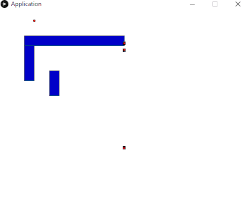

# minion-ga-path
A population of minions try to reach the goal using genetic algorithms


Developed using [Codebullet's dot tutorial](https://www.youtube.com/watch?v=BOZfhUcNiqk)

This is a test project using [Processing](https://processing.org/) integrated in [Eclipse](https://www.eclipse.org) with [Apache Maven](https://maven.apache.org) for project managemet.
## Howto build ##
----
Requirements:
 * Latest stable [Oracle JDK 8](https://www.oracle.com/technetwork/java/javase/downloads/index.html)
 * Latest stable [Apache Maven](https://maven.apache.org/download.cgi)
 
 ```
 cd minion-ga-path
 mvn clean package assembly:single
 java -jar target/minion-ga-path-1.0-SNAPSHOT-jar-with-dependencies.jar
 ```
